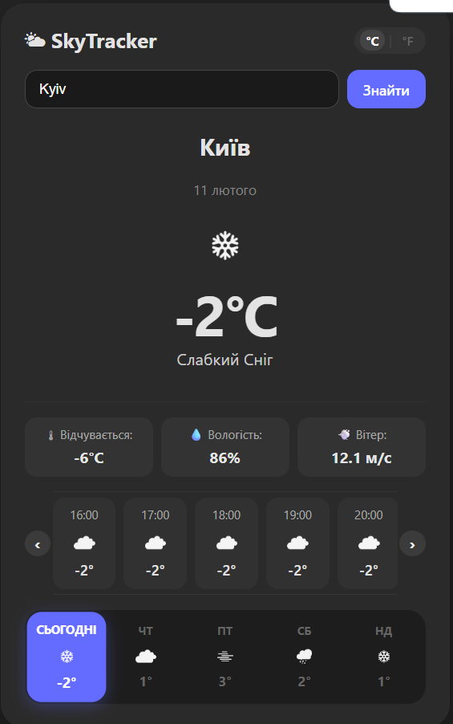

# 🌤 SkyTracker - Weather Dashboard


**[ 🇺🇦 Читати українською ](#-українська-версія) | [ 🇬🇧 Read in English ](#-english-version)**



---

<a name="-українська-версія"></a>
## 🇺🇦

**SkyTracker** — це сучасний веб-застосунок для моніторингу погоди в реальному часі. Проєкт розроблено з використанням архітектури **BFF**, що забезпечує безпеку даних, кешування запитів та оптимізацію продуктивності.

### 🚀 Ключові можливості

* **🌍 Smart Geolocation:** Автоматичне визначення міста користувача за IP-адресою при першому вході.
* **⚡ Server-Side Caching:** Реалізовано кешування на стороні сервера, що знижує навантаження на зовнішній API та забезпечує миттєве завантаження даних для повторних запитів.
* **📊 Advanced Data Filtration:** "Розумна" фільтрація погодинного прогнозу. При виборі будь-якого дня тижня відображається погодинний графік саме для **обраної дати**, а не просто найближчі 24 години.
* **🎨 UI/UX:** Адаптивний інтерфейс, підтримка темної теми, компактний режим відображення, кастомний горизонтальний скрол та мікро-анімації.
* **🛡 Secure Architecture:** Пряма взаємодія із зовнішніми API прихована за власним Proxy-сервером.

### 🛠 Технічний стек

#### Frontend
* **React 18** 
* **TypeScript**
* **Vite** 
* **CSS Modules** 

#### Backend
* **Node.js & Express**
* **Node-Cache** 
* **Axios**

### 💡 Інженерні рішення

1.  **Архітектура BFF:** Клієнт не звертається до погодних сервісів напряму. Всі запити йдуть через Express-сервер. Це вирішує проблеми CORS та дозволяє легко змінювати провайдера погоди без змін на фронтенді.
2.  **Оптимізація:** Сервер перевіряє наявність свіжих даних у кеші перед тим, як робити запит до зовнішнього API. Це значно економить ліміти запитів.

### 📦 Встановлення та запуск

1.  **Клонування репозиторію:**
    ```bash
    git clone https://github.com/devinsider18/weather-fullstack-app.git
    cd weather-fullstack-app
    ```

2.  **Встановлення залежностей (окремо для клієнта та сервера):**
    ```bash
    cd server && npm install
    cd ../client && npm install
    ```

3.  **Запуск:**
    * Термінал 1 (Сервер): `cd server && npm start`
    * Термінал 2 (Клієнт): `cd client && npm run dev`

---

<a name="-english-version"></a>
## 🇬🇧

**SkyTracker** is a modern web application for real-time weather monitoring. The project is built using the **BFF** architecture, ensuring data security, request caching, and performance optimization.

### 🚀 Key Features

* **🌍 Smart Geolocation:** Automatically detects the user's city via IP address upon first visit.
* **⚡ Server-Side Caching:** Implemented server-side caching to reduce load on external APIs and ensure instant data loading for frequent requests.
* **📊 Advanced Data Filtration:** Smart hourly forecast logic. Selecting a specific day of the week displays the hourly graph strictly for that **selected date**, rather than just a generic 24-hour loop.
* **🎨 UI/UX:** Fully responsive design, dark mode support, compact view mode, custom horizontal scrolling, and micro-animations.
* **🛡 Secure Architecture:** Direct interaction with external APIs is abstracted behind a custom Proxy Server.

### 🛠 Tech Stack

#### Frontend
* **React 18** 
* **TypeScript** 
* **Vite** 
* **CSS Modules** 

#### Backend
* **Node.js & Express** 
* **Node-Cache** 
* **Axios** 

### 💡 Engineering Decisions

1.  **BFF Architecture:** The client app never communicates with weather services directly. All requests go through the Express server. This solves CORS issues and allows for seamless weather provider swapping without frontend code changes.
2.  **Optimization:** The server checks for fresh data in the cache before making a request to the external API. This significantly saves API rate limits and improves latency.

### 📦 Installation & Setup

1.  **Clone the repository:**
    ```bash
    git clone https://github.com/devinsider18/weather-fullstack-app.git
    cd weather-fullstack-app
    ```

2.  **Install dependencies (separately for client and server):**
    ```bash
    cd server && npm install
    cd ../client && npm install
    ```

3.  **Run the application:**
    * Terminal 1 (Server): `cd server && npm start`
    * Terminal 2 (Client): `cd client && npm run dev`
